# PatentAnalyzer

PatentAnalyzer is an open-source tool that analyzes patent data. Its backend is implemented in Python using the Django framework, and its frontend is based on Vue. The tool is designed to be user-friendly and easily extendable, making it accessible to a wide range of users.

You can use PatentAnalyzer in the following URL, please note that our resources are limited: https://patentanalyzer.csd.auth.gr/

## What PatentAnalyzer offers

First you have to create an account and login and then you can use the tool.

#### Creating Reports

Easily generate reports by filtering the patents based on comprehensive filters.

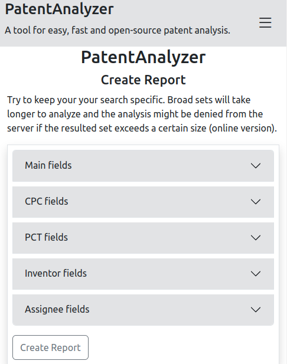

#### View Reports Anytime

Your reports are securely saved, accessible whenever you need them, ensuring you can track patent trends effortlessly.

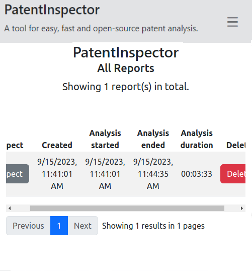


#### Statistical Measures
Quickly grasp the patent landscape with statistical metrics such as the average number of claims.

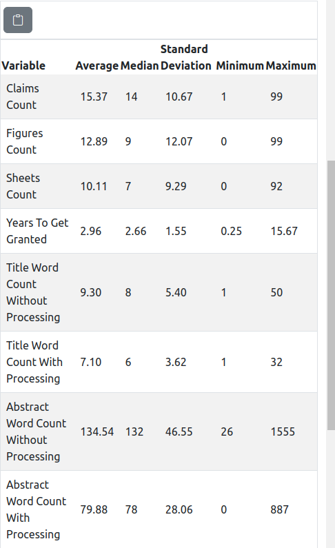

#### Time Series Analysis
Dive into how variables change over time with intuitive time series plots, helping you identify trends and patterns.

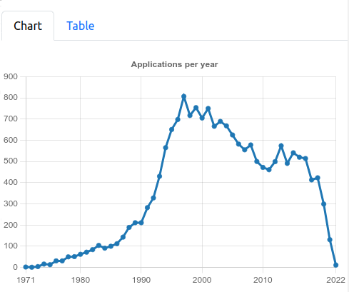

#### Interactive Exploration
Explore the patent landscape from various aspects with interactive plots, including bar charts and heat maps, to uncover hidden insights.

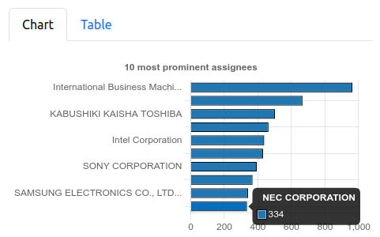
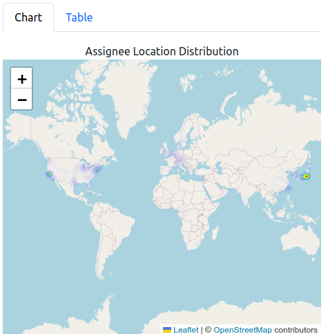

#### Thematic Analysis
Gain an understanding of the main topics within the patent landscape and their significance through visually engaging bar charts and scatter plots in the thematic analysis section.

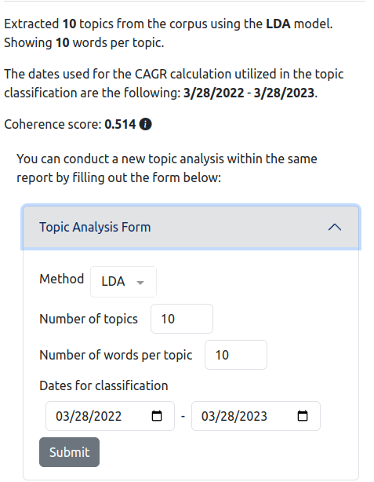
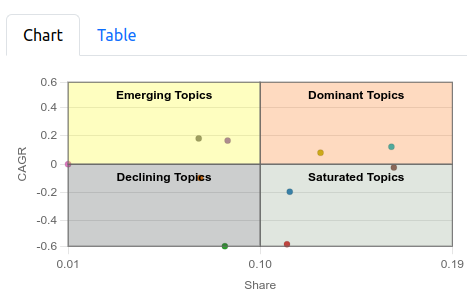
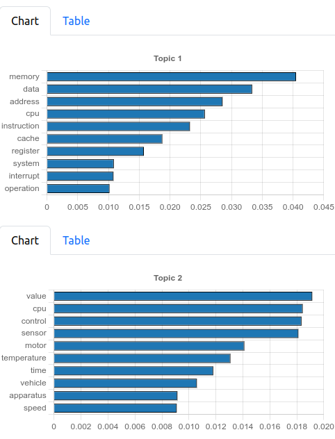

#### Citation Analysis
Visualize the citation network of patents in your reports and discover the most cited patents.

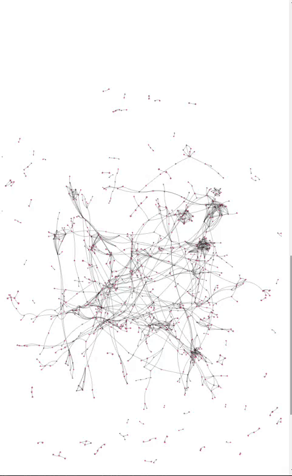
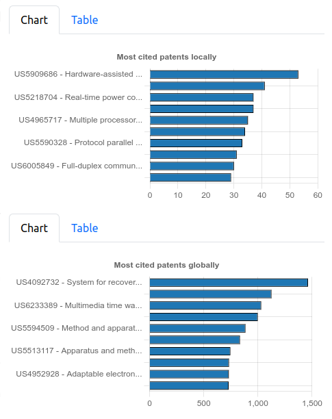

#### Quickly export charts
Each chart in PatentAnalyzer comes with a corresponding table that can be effortlessly copied with a single
click and seamlessly pasted into your spreadsheet of choice.

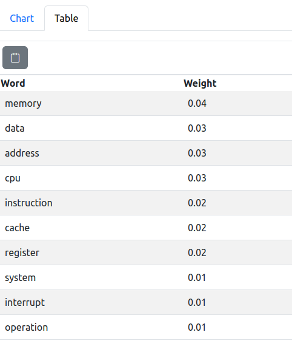

#### Download the filtered topics in excel format
PatentAnalyzer empowers you to export filtered topics in Excel format, providing you with the freedom to conduct further in-depth analyses on your terms.

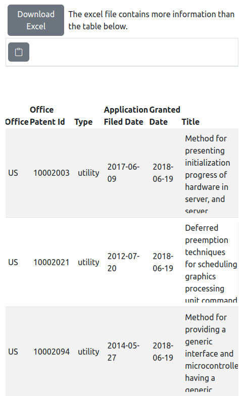

## How to run locally via docker (ideal for production)

Install [Docker](https://docs.docker.com/engine/install/) if you haven't already. Then run the following commands:

```shell

```

## How to run locally without docker (ideal for development)

### Backend (cd to backend directory)

1. Install `python`, `pip` and `virtualenv`.
2. Install `postgresql`, ideally version 15 and create an admin user.
3. Create a `.env` file based on the `.env.example` file
4. Create a database named to whatever `POSTGRES_DB` is set in your `.env` file and install the `postgis` and `pg_trgm` extensions to it. Most likely postgis has system dependencies that you need to install.
5. Create a virtualenv and activate it
6. Install the `requirements.txt` file using pip.
7.  - Run the `uspto` and `index` management commands to download data from the USPTO website and insert it to the database and index it
    - Or run the `load_database` management command to load the indexed database from a file stored in a remote server
8. Run the server with `python manage.py runserver`

### Frontend (cd to frontend directory)

1. Install `npm`
2. Run `npm install`
3. Run `npm run dev`
4. Visit the URL that is printed in the console (most likely http://localhost:5173/)

Remember if you get stuck you can always take a look at the docker files to see how we run the project in production. You can even open an issue if you want to ask something or suggest a change.

## Management Commands

### uspto

The `uspto` management command is used to download data from the USPTO website and insert into the database. It can be used as follows:

```shell
python manage.py uspto
```

### index

The `index` is a management command that is used to index the database. It can be used as follows:

```shell
python manage.py index
```

### dump_database

The `dump_database` command is used to dump the database into a file and upload it to Google Drive (if credentials are provided).
To provide credentials you need to create a service account key in [Google Cloud](https://cloud.google.com/iam/docs/keys-create-delete) and put the downloaded json in the `backend` directory with the name `service-secrets.json`. The use of command is as simple as:

```shell
python manage.py dump_database
```

### load_database

The `load_database` command is used to load the database from a file stored in a remote server. Links for download are configured in the `.env` file. Namely the `DOWNLOAD_BACKUP_URL1` variable is used to specify the URL for a Google Drive file, and the `DOWNLOAD_BACKUP_URL2` variable is used to specify a backup URL which can be anything else. The `.env.example` file contains valid URLs to download a database dump from Google Drive or Azure Blob Storage. To use the command you just have to run:

```shell
python manage.py load_database
```

# TODO

-   Create docker image (Make django q and gunicorn use env files for configuration)
